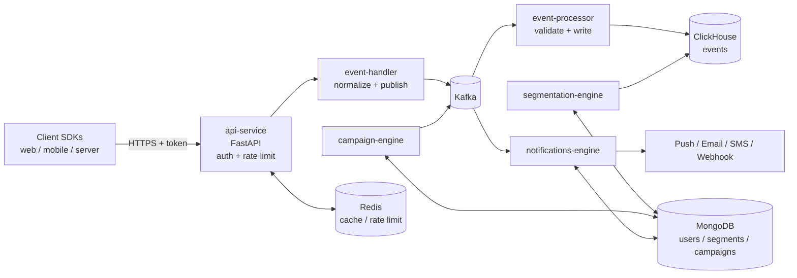

# PAM Architecture

## High-level data flow

## Service responsibilities

### api-service
Single entry point for all client SDK traffic. Validates project tokens, authenticates requests, enforces per-project rate limits via Redis, and forwards valid event/user calls to `event-handler` over an internal HTTP or gRPC channel. **Never writes to Kafka or DBs directly.**

### event-handler
Receives normalized event/user payloads from `api-service`. Adds server-side metadata (received_at, server_ip), partitions by `user_id` for ordering, and publishes to Kafka topics. Stateless and horizontally scalable.

### event-processor
Kafka consumer. Validates each event against the schema in `shared/models/events.py`. Writes successful events to ClickHouse in batches. Sends invalid events to a dead-letter topic. **Owner of the ClickHouse events tables.**

### segmentation-engine
Compiles segment definitions (DSL → SQL/aggregation pipeline) and evaluates them against ClickHouse + MongoDB. Persists segment metadata and computed memberships in MongoDB. Re-evaluates on a schedule and on relevant events.

### campaign-engine
CRUD for campaigns (rules, audience = segment id, schedule, channel). Listens for trigger events on Kafka, resolves audiences via `segmentation-engine`, and emits "send" jobs to a Kafka topic consumed by `notifications-engine`.

### notifications-engine
Workers that consume send jobs, render templates, call channel providers (FCM/APNs/SES/Twilio/webhook), record delivery status in MongoDB, and emit delivery events back to Kafka so they appear in analytics.

## Data ownership

| Data | Owner | Read-only consumers |
|---|---|---|
| Raw events (ClickHouse) | event-processor | segmentation-engine, campaign-engine, ad-hoc analytics |
| User profiles (MongoDB) | api-service / event-handler | segmentation-engine, campaign-engine, notifications-engine |
| Segments (MongoDB) | segmentation-engine | campaign-engine |
| Campaigns (MongoDB) | campaign-engine | notifications-engine |
| Delivery records (MongoDB) | notifications-engine | analytics |
| Auth tokens / project metadata (MongoDB) | api-service | (none — read via api-service only) |
| Rate limit counters (Redis) | api-service | — |

**Rule:** services do not read another service's primary store directly except for ClickHouse (which is intentionally a shared analytical store).

## Why Kafka in the middle

- Decouples ingestion from processing — spikes don't lose events.
- Lets us replay events to reprocess (schema changes, bug fixes).
- Lets multiple consumers read the same stream (analytics + segmentation triggers + audit).

## Scaling notes

- `api-service` and `event-handler` are stateless — scale horizontally behind a load balancer.
- `event-processor` scales by Kafka partitions. Partition key = `user_id` for ordering per user.
- `segmentation-engine` segment recompute is the heaviest workload — runs as scheduled jobs, not in request path.
- `notifications-engine` workers scale per channel; bottleneck is provider rate limits.

## Failure modes (must-handle)

- Kafka unavailable → `event-handler` returns 503; `api-service` does NOT buffer in-process (fail fast).
- ClickHouse write fails → `event-processor` retries with backoff, then sends to DLQ topic.
- Provider rate limit → `notifications-engine` exponential backoff with jitter, capped retry.
- Token leak → `api-service` supports immediate token revocation via Redis blocklist.

See [`docs/`](docs/) for the contracts that pin all of this down.
