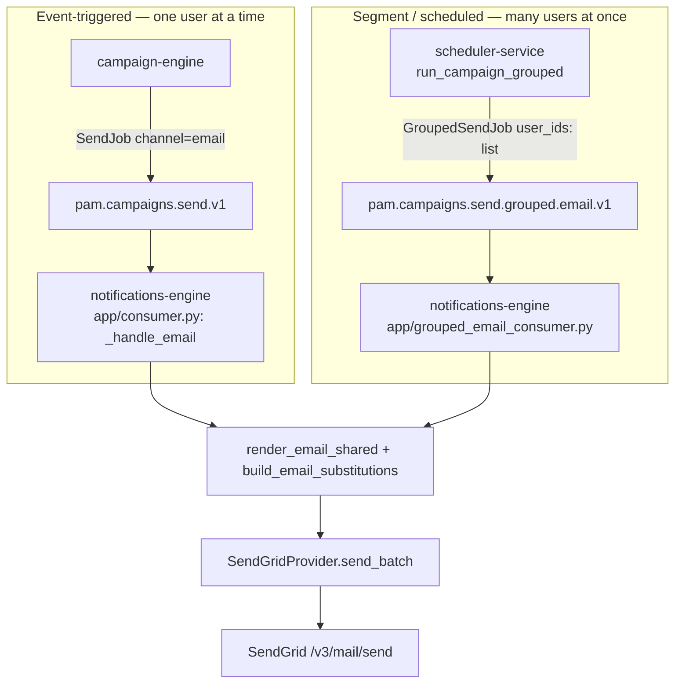

# Email Notification Channel (SendGrid) — Technical Design

Status: implemented (delivery pipeline + campaign-engine admin API + portal UI),
pending live-infra/click-through verification (see [§11](#11-known-gaps--follow-ups)
and [§13](#13-addendum-campaign-engine-admin-api--portal-ui)).
Audience: PAM engineering team.

## 1. Overview

PAM previously delivered push notifications only. This change adds **email via SendGrid**
as a second channel, built so the same mechanism is reusable for SMS/WhatsApp/Telegram
later. It touches `scheduler-service`, `notifications-engine`, and `shared/` for the
delivery pipeline (§1-§11 below), and `campaign-engine` plus the portal frontend
(`front-end/wynta-crm`, `front-end/wynta-react-common`) for campaign/template
authoring and SendGrid credential settings (§13). `api-service` is not touched at all.

Two things drove the design beyond "just add a provider":

1. **Timing**: campaigns should trigger email at close to the same instant as the
   campaign fires. This turned out to already be solved by the existing architecture
   (see [§3](#3-architecture)) — no new work was needed for it.
2. **Scale**: a segment-targeted campaign can span tens of thousands of recipients.
   Sending one SendGrid API call per recipient does not scale — this is the problem
   most of this design is actually about, and it's discussed in depth in [§4](#4-key-design-decisions).

## 2. Goals & Constraints

- Trigger email as close to campaign-trigger time as possible.
- Support both trigger shapes: **event-triggered** (one user reacts to a live event)
  and **segment/scheduled** (a campaign blasts a whole segment at once).
- Batch provider API calls for segment blasts, without sacrificing per-user
  personalization (name, cart value, etc.) or Kafka's existing delivery guarantees.
- Reuse existing patterns (provider abstraction, circuit breaker, delivery bookkeeping)
  rather than inventing new ones.
- Make the batching mechanism generic enough that SMS/WhatsApp/Telegram can reuse it later.

## 3. Architecture

### 3.1 Two delivery paths



Both paths converge on the same renderer functions and the same
`SendGridProvider.send_batch()` — the only difference is how many recipients get
bundled into one call (1 vs. N) and which Kafka topic they arrived on. This means
there is exactly one rendering/sending code path to maintain, not two.

Push and in_app are **completely unaffected** — they keep using their existing topic
(`pam.campaigns.send.v1`) and consumer (`app/consumer.py`'s `consumer_loop`) exactly as
before. Email's grouped path runs on its own topic, its own consumer group, and its own
Kafka fetch-batch tuning, in a second background task inside the same
`notifications-engine` process.

### 3.2 Why timing was "free"

campaign-engine and scheduler-service already hand off to notifications-engine purely
via a live Kafka consumer — not polling. Whatever channel is added inherits
near-real-time delivery automatically, since Kafka delivers new messages to a waiting
consumer within milliseconds. No new work was needed here; it's a property of the
architecture that already existed for push.

## 4. Key Design Decisions

### 4.1 Where does batching happen? (the central decision)

**The problem**: notifications-engine processes messages under a concurrency cap.
Each email requires a real network round-trip to SendGrid (~100-300ms), unlike push's
much faster FCM calls. Sent as one API call per user, a 10,000-user segment takes
1.5-2 minutes to fully drain on one instance. SendGrid supports up to **~1000
recipients per API call** (`personalizations`) — collapsing many recipients into one
call is the fix.

Three approaches were evaluated:

| Approach | Where grouping happens | Verdict |
|---|---|---|
| Buffer inside notifications-engine, across multiple Kafka fetches, with a timer | notifications-engine, decoupled from Kafka's commit cycle | **Rejected.** Kafka only commits an offset after a fetch's callback returns. Anything sitting in a cross-fetch buffer when a pod crashes is silently lost — no redelivery. Regresses the at-least-once guarantee push already has. |
| Give email its own Kafka topic; bucket opportunistically inside the consumer, within one already-fetched batch | notifications-engine, but only within one atomic commit unit | Durable and simple, but batching quality depends on how much *unrelated* concurrent campaign traffic shares the topic — degrades as more tenants/campaigns run simultaneously on the platform. |
| **Group upstream, in scheduler-service, before anything reaches Kafka** | scheduler-service | **Chosen.** See below. |

**Why upstream grouping won**: a campaign always has exactly one
`project_id`/`brand_id`/`template_id` by definition. So when `run_campaign_grouped()`
accumulates users from *one campaign's* segment stream, the resulting group is
homogeneous by construction — there is no bucketing/regrouping step to get wrong, and
batch quality is **completely independent of how many other campaigns are running
elsewhere on the platform at the same time**. This was the deciding factor: the
consumer-side-bucketing alternative gets *worse* precisely as PAM scales to more
concurrent tenants, which is the wrong direction for a scaling business.

**Durability**: the user list is embedded **directly** in the `GroupedSendJob` message
body — not a reference to a Redis-held list. A Redis-based reference was considered and
rejected: a Redis key could expire or be evicted before a legitimate Kafka redelivery
(which can happen hours/days later, within the topic's 3-day retention), silently
losing an entire group with no trace. Embedding the list directly means Kafka's
existing durability (replication + manual-commit-after-callback, already used by the
push consumer) fully covers the group as one unit. No new persisted queue, no
background flush worker, no distributed lock was needed anywhere in this design.

If message size ever becomes a real concern for very large groups (e.g. a future
WhatsApp batch size of 10,000), the fix is a standard operational one — raise
`message.max.bytes` on that topic — not an architecture change.

### 4.2 Personalization: why templates use two syntaxes

SendGrid's `/v3/mail/send` API shares **one content block** (subject/html/text) across
every recipient in a single call — `personalizations` only varies `to` and a
per-recipient `substitutions` dict. Fully-baked, per-user-distinct HTML (which is what
naive server-side Jinja2 rendering produces) has nowhere to go in a batched call —
there is only one shared content slot per request.

To batch *with* personalization, email templates mix two things:

- **Real Jinja2** (`{{ project.name }}`) for content that's identical for the whole
  batch — rendered once, server-side, via `render_email_shared()`.
- **Literal SendGrid substitution tokens** (`-user.name-`, `-ctx.cart_value-`,
  `-unsubscribe_url-`) for anything that varies per recipient — these are NOT Jinja
  syntax and pass through `render_email_shared()` completely untouched. Per-recipient
  values are supplied separately via `build_email_substitutions()`, and SendGrid fills
  the tokens in per-recipient at send time.

A template that mistakenly writes `{{ user.name }}` (real Jinja) instead of
`-user.name-` will raise `TemplateRenderError`, since `user`/`ctx` are deliberately
**not** part of the shared render context — this is an intentional guardrail, not a bug.

This model is also why the design is naturally reusable for SMS/WhatsApp/Telegram:
WhatsApp's Business API *requires* pre-approved templates with numbered variable
placeholders for any business-initiated message — the shared-template-plus-variables
model isn't a workaround there, it's mandatory.

### 4.3 PII: plaintext email storage

`docs/notifications-channels.md` previously described a "PII vault" for resolving
`email_hash` → plaintext email — that vault never existed in the codebase.
`notifications-engine/CLAUDE.md` had a hard rule: *"NEVER store raw PII (email/phone).
Decrypt from vault per-send only."*

**Decision**: store `users.traits.email` in **plaintext**, no vault. This is a
conscious, documented exception — `notifications-engine/CLAUDE.md`'s rule was narrowed
to phone/SMS only, with an explicit note that email is an approved exception. This
should be revisited if/when a real PII vault is built for phone numbers.

### 4.4 Suppression is now channel-scoped

Previously, `is_suppressed(redis, project_id, user_id)` checked one Redis key per
`(project_id, user_id)` — shared across every channel. Adding email meant a hard email
bounce would have silently suppressed that user's push notifications too, which is
wrong (an invalid email address says nothing about push-token validity).

**Change**: the key format became `pam:suppress:{project_id}:{user_id}:{channel}`, and
`is_suppressed()`/`suppress()` now take a `channel` argument. This is a **data format
change**, not just a code change — see [§9](#9-regression-risk) for the migration
implication.

### 4.5 Unsubscribe: self-signed, not SendGrid-native

PAM generates and signs its own one-click unsubscribe link (`app/unsubscribe.py`,
HMAC-SHA256 over `project_id:user_id`), injected as the `-unsubscribe_url-` token —
rather than relying on SendGrid's native Subscription Tracking feature. This keeps the
link's format and landing page under PAM's own control (`GET /api/v1/email/unsubscribe`)
rather than delegating it to SendGrid's account-level settings.

### 4.6 Bounce/complaint handling

SendGrid's **Event Webhook** (`POST /api/v1/email/events`) is signed with SendGrid's own
ECDSA scheme (`X-Twilio-Email-Event-Webhook-Signature`/`-Timestamp` headers) — this is
distinct from PAM's outbound `webhook` channel's HMAC scheme (that one governs
customer-facing webhooks PAM sends out; this one is inbound, from SendGrid to PAM).

Each event echoes back the `custom_args` (`project_id`, `user_id`, `send_id`) set at
send time, so events correlate to a user without a reverse lookup by email address.
Hard `bounce` and `spamreport`/`unsubscribe`/`group_unsubscribe` events suppress the
user; a soft bounce (`type: blocked`) does **not**, since it may succeed on a later
attempt.

## 5. Implementation Details

### 5.1 `shared/clients/mongo.py` (additive only)

| Function | Purpose |
|---|---|
| `get_project_sendgrid_credential(db, project_id, brand_id=None)` | Brand→project fallback for `{api_key, from_email, from_name}` — mirrors `get_project_fcm_credential` exactly. |
| `upsert_brand_sendgrid_credential(...)` | Companion writer for the above. |
| `get_project_batch_size_overrides(db, project_id)` | Reads `projects.settings.batch_size_overrides`. |
| `add_suppression(db, project_id, user_id, channel, reason, now)` | Upserts into the new `suppressed_recipients` collection (durable audit trail). |
| `create_suppression_indexes(db)` | Unique index on `{project_id, user_id, channel}`. |

`get_users_batch()` already existed (an `$in` query keyed by `user_id`) and is reused
as-is by the grouped consumer.

### 5.2 `scheduler-service`

- **`app/config.py`**: `batch_size_default` (500), `batch_size_email` (500),
  `batch_size_sms` (1000), `batch_size_whatsapp` (10000) — static per-channel defaults.
  Adding a future channel is one new field.
- **`app/sender.py`**: new `run_campaign_grouped()`, sitting alongside the original
  `run_campaign()` (which push/in_app still use, completely unchanged). Same
  `_in_audience`/`_rate_allowed`/`_mark_sent` per-user checks as today — the only
  difference is that instead of calling `_emit_send_job()` immediately per passing
  user, passing `user_id`s are accumulated into a buffer and flushed as one
  `_emit_grouped_send_job()` call once the buffer reaches the resolved group size
  (remainder flushed at the end of the segment stream). Group size resolution:
  `_resolve_batch_size(channel, overrides)` — checks the project's
  `batch_size_overrides` first, falls back to the static per-channel setting, falls
  back to the global default.
  **Important**: this function never fetches a user profile document. It only ever
  accumulates and emits `user_id` strings — personalization happens entirely in
  notifications-engine (see [§4.2](#42-personalization-why-templates-use-two-syntaxes)).
- **`app/executor.py`**: `handle_execution()` dispatches to `run_campaign_grouped()` for
  `channel in {"email", "sms", "whatsapp", "telegram"}` (`_GROUPED_CHANNELS`), unchanged
  `run_campaign()` otherwise.

`GroupedSendJob` itself is built as a plain dict in `_emit_grouped_send_job()`
(mirroring how the existing single-user `SendJob` is also built as a dict here,
not a Pydantic model — that model only exists on the consuming side, in
notifications-engine, where it gets parsed/validated).

### 5.3 `notifications-engine`

- **`app/providers/base.py`**: new `EmailRecipient(email, substitutions, custom_args)`
  and `BatchProviderResult`. The existing push-shaped `Recipient`/`RenderedPayload`/
  `ChannelProvider` are untouched — email doesn't fit that single-recipient Protocol,
  so it gets its own parallel shapes rather than forcing a fit.
- **`app/providers/email.py`** (new): `SendGridProvider.send_batch(recipients,
  subject_template, html_template, text_template)` — one `POST /v3/mail/send` with up
  to `sendgrid_max_personalizations` (1000) personalizations. Same
  transient-vs-permanent error split as `push.py`'s `FcmV1Provider` (5xx/429 → raises
  `SendGridTransientError`, feeding the circuit breaker; other 4xx → returns
  `rejected`, no circuit hit). `SendGridStubProvider` for dev/unconfigured fallback.
  `get_email_provider()` mirrors `get_push_provider`'s brand→project→stub resolution.
- **`app/renderer.py`**: `render_email_shared()` and `build_email_substitutions()` —
  see [§4.2](#42-personalization-why-templates-use-two-syntaxes).
- **`app/consumer.py`**: new `_handle_email()` — the event-triggered (single-recipient)
  path. Wired in as a new `channel == "email"` branch in `handle_send_job()`, sitting
  after the existing `in_app` branch and before the push device-token fan-out. Calls
  the same renderer/provider functions as the grouped path, with a one-element
  recipient list.
- **`app/grouped_email_consumer.py`** (new): its own `KafkaConsumer` instance
  (`pam.campaigns.send.grouped.email.v1`, group `notif-sender-grouped-email`, its own
  fetch-batch size/timeout settings — fully independent of the push/in_app consumer's
  tuning). `handle_grouped_email_job()`: batch-fetches users, batch-checks suppression
  (one Redis pipeline call), renders the shared template once, builds substitutions
  per surviving recipient, chunks to `sendgrid_max_personalizations` as a safety net,
  fires one (or a few, if the group exceeds the ceiling) `send_batch()` call(s).
  **Notable implementation detail**: `notification_deliveries` has a unique index on
  `(send_id, token_hash)` for idempotency. In the single-user path, `send_id` is unique
  per user, so an empty `token_hash` for a "no email address" failure is safe. In the
  *grouped* path, one `send_id` covers many users — if two users in the same group both
  lack an email address, they'd both try to write `token_hash=""` under the same
  `send_id` and collide, silently dropping the second one's failure record. This is
  fixed via `_token_hash(discriminator, user_id)` — every delivery record's
  `token_hash` is a hash of `{reason}:{user_id}`, guaranteeing uniqueness per user
  within a shared `send_id` regardless of failure reason.
- **`app/suppression.py`**: `is_suppressed()` now takes `channel`; new
  `suppressed_user_ids()` (batch, one Redis pipeline) and `suppress()` (write path,
  used by `callbacks.py`).
- **`app/unsubscribe.py`** (new): `build_unsubscribe_url()` / `verify_unsubscribe_token()`.
- **`app/callbacks.py`** (new): `POST /api/v1/email/events` (SendGrid Event Webhook,
  ECDSA-verified) and `GET /api/v1/email/unsubscribe` (HMAC-verified one-click landing page).
- **`app/main.py`** (rewritten): raw-socket health server → FastAPI + `lifespan`,
  following `campaign-engine/app/main.py`'s established pattern. Starts **two**
  background consumer tasks (the original `consumer_loop` for push/in_app, plus the
  new `grouped_email_consumer_loop`), serves `/health` and the new `/api/v1/email/*` routes.

## 6. Data Model Reference

**`GroupedSendJob`** (notifications-engine's `app/models.py`, parsed from what
scheduler-service's `_emit_grouped_send_job()` produces):

```python
class GroupedSendJob(BaseModel):
    send_id: str
    project_id: str
    campaign_id: str
    campaign_run_id: str
    user_ids: list[str]
    brand_id: str | None = None
    channel: str
    template_id: str
    context: dict[str, Any] = {}
    deliver_at: datetime
```

**New MongoDB fields/collections** (see `docs/mongodb-collections.md` for full schemas):

- `users.traits.email` — plaintext, alongside the existing `traits.email_hash`.
- `projects.settings.batch_size_overrides` — e.g. `{"email": 300}`.
- `projects.settings.sendgrid_api_key` / `.sendgrid_from_email` / `.sendgrid_from_name`
  — project-level fallback credential.
- `brand_settings.sendgrid_api_key` / `.sendgrid_from_email` / `.sendgrid_from_name` —
  brand-level credential (checked first).
- `suppressed_recipients` (new collection) — durable audit trail behind the Redis
  suppression key.

## 7. Configuration Reference

**`scheduler-service/app/config.py`**:

| Setting | Default | Purpose |
|---|---|---|
| `kafka_send_topic_grouped_email` | `pam.campaigns.send.grouped.email.v1` | Output topic for grouped email jobs. |
| `batch_size_default` | 500 | Fallback for any channel without a specific setting. |
| `batch_size_email` | 500 | Email group size default. |
| `batch_size_sms` / `batch_size_whatsapp` | 1000 / 10000 | Reserved for future channels. |

**`notifications-engine/app/config.py`**:

| Setting | Default | Purpose |
|---|---|---|
| `kafka_send_topic_grouped_email` | `pam.campaigns.send.grouped.email.v1` | Consumed topic. |
| `email_grouped_consumer_group` | `notif-sender-grouped-email` | Independent consumer group. |
| `email_grouped_kafka_batch_size` / `_timeout_ms` | 20 / 1000 | Fetch-batch tuning, independent of push/in_app's. |
| `sendgrid_max_personalizations` | 1000 | Provider ceiling — chunking safety net. |
| `sendgrid_webhook_public_key` | `""` | SendGrid Event Webhook ECDSA public key. Signature verification is **skipped with a warning** if left empty — must be set before production use. |
| `unsubscribe_hmac_secret` | placeholder | **Must be overridden** in every real environment. |
| `public_base_url` | `http://localhost:8005` | Base URL embedded in unsubscribe links — must be the externally-reachable URL in each environment. |

SendGrid API keys/from-addresses are **not** service config — they live in MongoDB
(`brand_settings`/`projects.settings`), per-brand-then-per-project, exactly like FCM
credentials.

## 8. Kafka Topics

| Topic | Producer | Consumer | Key | Notes |
|---|---|---|---|---|
| `pam.campaigns.send.v1` (existing) | campaign-engine, scheduler-service | notifications-engine (`notif-sender`) | `user_id` | Push, in_app, and single-recipient email — unchanged. |
| `pam.campaigns.send.grouped.email.v1` (new) | scheduler-service | notifications-engine (`notif-sender-grouped-email`) | `campaign_id` | Grouped email only. Partitions: 12. Retention: 3 days. |

## 9. Regression Risk

Ranked by severity — see the full breakdown originally captured in the design plan.

- 🔴 **`app/main.py` full rewrite** — bootstraps *everything*, including push/in_app.
  Verify push/in_app still deliver end-to-end, health check responds, and both
  consumer tasks start/stop cleanly on deploy/restart.
- 🟠 **`is_suppressed()` signature/key-format change** — a genuine **data migration**
  concern. Any pre-existing `pam:suppress:{project_id}:{user_id}` keys (old format,
  no channel suffix) will silently stop matching after this ships. **Check production
  Redis for existing `pam:suppress:*` keys before deploying** and migrate/dual-read if
  any are found.
- 🟡 `app/consumer.py`, `app/providers/base.py`, `scheduler-service/app/executor.py` —
  small, contained additions; existing push/in_app code paths and dataclasses are
  untouched. Verified via the existing push/in_app unit tests still passing.
- 🟢 Everything else — additive only (new files, new collection, new topic).
  (`campaign-engine` was untouched by the delivery-pipeline work described in §1-§11 —
  it was touched later, for campaign/template authoring, per §13.)

## 10. Testing

- **notifications-engine**: 20/22 tests pass. The 2 failures
  (`test_render_push_resolves_vars`, `test_render_push_missing_var_raises`) are a
  **pre-existing, unrelated bug** in `render_push` — confirmed via `git diff` that
  neither `render_push` nor those two tests were touched by this change. Not fixed as
  part of this work; worth a separate look.
- **scheduler-service**: 7/7 tests pass, including new coverage for
  `_resolve_batch_size` (override → channel default → global default fallback),
  `_emit_grouped_send_job`'s message shape, and `_process_user_grouped`'s audience/rate-limit gating.
- New tests added: SendGrid provider (accepted/transient/permanent-error paths, stub
  fallback), `render_email_shared`/`build_email_substitutions` (including the
  intentional-failure case for real Jinja syntax on a per-user field), channel-scoped
  suppression, `GroupedSendJob` parsing.
- All new/rewritten modules (`main.py`, `grouped_email_consumer.py`, `callbacks.py`,
  `sender.py`, `executor.py`) were sanity-checked to import cleanly with no circular
  imports.

## 11. Known Gaps / Follow-ups

- **Not yet verified against live infra** — no real MongoDB/Kafka/Redis/SendGrid stack
  was available in the implementation session. Before shipping: seed a real
  `channel: "email"` template + test user + SendGrid credential, trigger both paths
  end-to-end, and simulate a SendGrid bounce webhook against a running instance.
- **Redis suppression-key migration** (see §9) needs to be checked against the actual
  production Redis before this deploys.
- **`sendgrid_webhook_public_key`/`unsubscribe_hmac_secret`/`public_base_url`** need
  real per-environment values — the defaults are dev-only placeholders.
- **No per-campaign batch-size override** — deliberately deferred; only a per-project
  override exists today (`projects.settings.batch_size_overrides`).
- **SMS/WhatsApp/Telegram** are not implemented — `_GROUPED_CHANNELS` and the
  batch-size config already anticipate them, but each needs its own topic, provider,
  and (per §4.2) its own template-variable model.
- **The pre-existing `render_push` test failures** (§10) are unrelated to this change
  and were left as-is.

## 12. Addendum: email provider registry (generalized post-launch)

The initial implementation had `app/providers/email.py` directly define
`SendGridProvider` — functionally correct, but tightly coupled to one vendor. This was
generalized:

- **`app/providers/base.py`** gained an `EmailProvider` Protocol (`name`,
  `async def send_batch(...)`) — the formal contract any vendor adapter implements.
- **`app/providers/sendgrid.py`** (renamed from the original `email.py`) now holds only
  `SendGridProvider`/`SendGridStubProvider`/`SendGridTransientError` — purely the
  SendGrid adapter, nothing else.
- **`app/providers/mailgun.py`** (new) — `MailgunProvider`, wired into credential
  resolution and the registry exactly like SendGrid, but `send_batch()` intentionally
  raises `NotImplementedError`. This is a deliberate "empty" implementation: it proves a
  brand configured for Mailgun actually resolves to a different class, not a silent
  SendGrid fallback, without pretending real Mailgun sending exists yet.
- **`app/providers/email.py`** (repurposed) is now a small registry —
  `get_email_provider()` reads a new `email_provider: "sendgrid" | "mailgun"`
  discriminator (`brand_settings`, falling back to `projects.settings`, defaulting to
  `"sendgrid"` when absent — so every brand configured before this field existed keeps
  working with zero data migration) and dispatches to the matching adapter + credential
  getter.
- **New MongoDB fields** (additive only, no rename/migration): `email_provider` on
  `brand_settings`/`projects.settings`; `mailgun_api_key`/`mailgun_domain`/
  `mailgun_from_email`/`mailgun_from_name` alongside the existing `sendgrid_*` fields
  (mirroring how `fcm_service_account_json` and `sendgrid_*` already coexist there).
- **Explicitly out of scope**: priority-ordered auto-failover between multiple
  providers for one brand (e.g. SendGrid primary, Mailgun secondary). That needs a
  further extension on top of this registry — a list of providers per brand instead of
  one, a fallback loop, and per-brand-scoped circuit breakers (today's breaker is keyed
  only by provider name globally, so one brand's SendGrid outage would otherwise trip
  the breaker for every other brand still using SendGrid). Deferred as a separate,
  larger piece of work.

## 13. Addendum: campaign-engine admin API + portal UI

Everything above covers the delivery pipeline — but there was no way to actually
*create* an email campaign or *configure* SendGrid credentials through the portal until
this addition. `campaign-engine` (the admin API the portal calls) previously had zero
email-specific support, and the portal had partial, broken scaffolding for it (an
"Email" card in the campaign channel picker whose content was silently never sent to
the backend; a fully-built SendGrid connector modal that was hidden and pointed at an
unrelated, brand-agnostic endpoint).

**`campaign-engine` (`services/campaign-engine/`):**
- `app/models.py` — new `EmailTemplateBody{subject, html, text}`, wired in as a fourth
  option on `ChannelConfig` (alongside `template_id`/`message`/`template`) and as the
  required, now schema-validated shape for `channel:"email"` templates (previously
  `channel:"email"` accepted *any* non-empty dict with zero validation). New
  `SendgridSettingsRequest`/`BrandSendgridSettingsRequest` models.
- `app/routes/campaigns.py` — a third inline-template-creation branch in both
  `create_campaign_route` and `update_campaign_route`, mirroring exactly how push's
  `message` and in_app's `template` already auto-create a `notification_templates` doc.
- `app/routes/settings.py` — new SendGrid routes mirroring the FCM routes 1:1: project
  `PUT`/`GET`, brand `PUT`/`GET`/`DELETE`, and `POST .../verify` (a lightweight
  authenticated `GET https://api.sendgrid.com/v3/user/account` — proves credential
  validity, not delivery, matching FCM's verify semantics exactly).
- **Bug fixed along the way**: `delete_brand_fcm_settings` used `delete_one()` on the
  whole `brand_settings` doc instead of `$unset`-ing only its own fields — meaning
  disconnecting FCM for a brand would have silently wiped that brand's SendGrid
  credential too (and vice versa), since both now live on the same per-brand doc. Both
  the existing FCM delete route and the new SendGrid delete route use `$unset` now.
- `shared/clients/mongo.py` — one new function, `get_brand_sendgrid_settings`,
  mirroring `get_brand_fcm_settings` exactly.

**Frontend (`front-end/wynta-crm`, `front-end/wynta-react-common`):**
- `components/campaigns/CampaignWizard.tsx` — a new `EmailContentEditor` component
  (mirroring how `InAppEditor` is already its own component), authoring email content
  as a plain subject `<input>` + HTML `<textarea>` + optional plain-text `<textarea>` —
  no rich-text/WYSIWYG editor, matching push's existing plain-input convention (this app
  has none anywhere yet). Includes a token-insertion helper (reviving the same
  cursor-insertion mechanic already written, but dead/commented, for push's own
  placeholder helper) and inline hint text explaining the two-syntax rule: real Jinja2
  (`{{ project.x }}`) for content shared across the whole batch vs. literal
  `-user.x-`/`-unsubscribe_url-` tokens for anything per-recipient (see §4.2) — a
  template author who writes real Jinja for a per-recipient field gets a clear failure,
  not silently wrong output, per `render_email_shared()`. Also tightened Step 1's
  "Trigger criteria" card from `!isPush` to `isInApp` specifically, since that field is
  an in_app SDK-display concept meaningless for email (and every other non-in_app
  channel) — it was previously shown, incorrectly, for email too.
- `services/campaignApi.ts` — `Campaign`/`CampaignPayload` gained `email_subject`/
  `email_html`/`email_text`. `toApiPayload()` serializes them into `channel.email` for
  the wire request. `toCampaign()` reads them back off the *same* `message`-resolution
  chain already used for push — confirmed directly (not assumed) that
  `get_campaign_route` generically echoes the resolved template body under
  `doc.message` for every channel, so an email campaign's response has
  `{subject, html, text}` sitting under that same key, not a separate `channel.email`
  shape.
- `workspace-settings/tabs/ConnectorSettings.tsx` — un-hid the Email tab
  (`VISIBLE_CATEGORIES`, previously filtered out with a `// TODO: temporarily hidden`
  comment). The existing SendGrid modal gained a Brand ID field and was repointed from
  the generic, brand-agnostic `/workspace/settings/connectors/...` endpoint to the new
  per-brand `campaign-engine` routes above — new `loadSgStatus`/`verifySgCredentials`/
  `saveSgConnection`/`disconnectSg` functions mirroring their FCM counterparts exactly.
  Mailgun/MS-Exchange/Google-SMTP's modals and the generic endpoint they share were left
  completely untouched.

**Verification performed:** Pydantic-level sanity checks (`ChannelConfig` email/message
mutual exclusivity, `CreateTemplateRequest` email body validation) run directly;
`campaign-engine`'s existing pytest suite re-run — confirmed via `git diff` that the
only pre-existing failures (`test_trigger_scheduled.py` collection error,
`test_audience.py` mock-target failures) are in files untouched by this change; both
frontend packages (`wynta-crm`, `wynta-react-common`) type-checked with `tsc --noEmit`
with zero errors attributable to any file touched here (the only errors present are
pre-existing CSS-side-effect-import warnings in unrelated files).

**Not verified**: no live click-through of the wizard/connector UI against a running
campaign-engine + portal (no dev server available in the implementation session) — the
end-to-end verification steps in the original plan (create a real email campaign
through the UI, connect a real SendGrid brand credential through the settings UI,
confirm delivery) still need to be run manually before this ships.
