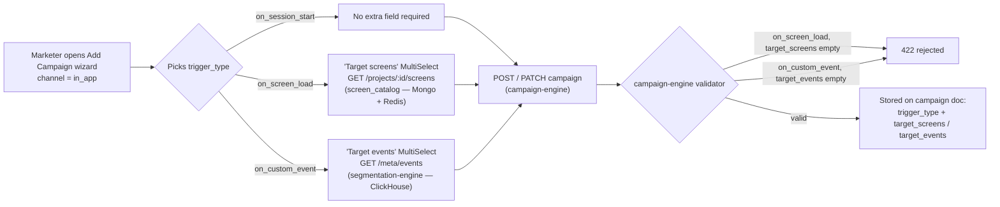
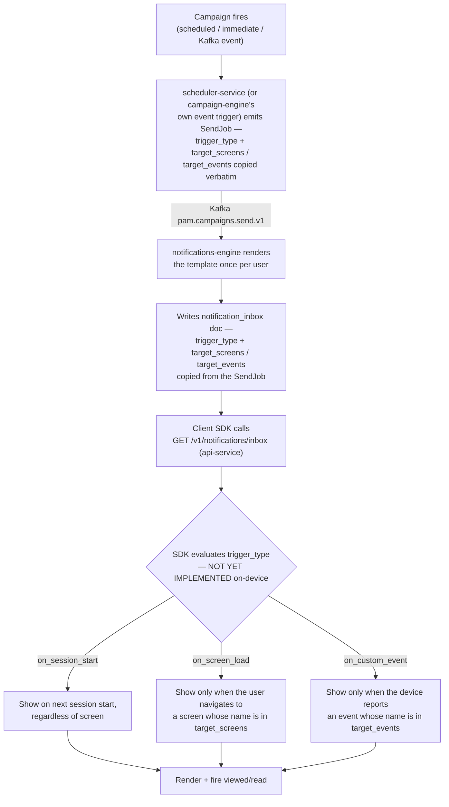

# In-App Notifications — Backend Data Design

Companion to [`in-app-notifications-explained.md`](in-app-notifications-explained.md), which documents the client-facing API and content schema. This file covers how that content is stored, and how it flows end to end.

Two collections are needed — one for the **authored template** (owned by campaign-engine, written by the CRM) and one for the **per-user delivered copy** (owned by notifications-engine, read by the inbox API). They're separate for the same reason push already works this way: content is *rendered once at send time* and frozen into a per-user record, so if a marketer edits the campaign later, notifications already sitting in someone's inbox don't silently change.

## Database Design

### 1. `notification_templates` — the authored content (campaign-engine)

One document per template, with variants nested for A/B testing (matches the builder's "+ Add Variation"):

```js
{
  _id: ObjectId,
  template_id: "tmpl_welcome_bonus",
  project_id: "proj_123",
  channel: "in_app",
  variants: [
    {
      variant_id: "var_a",
      weight: 50,                          // % split for A/B
      template_type: "modal",              // modal | popup_image | rating | fullscreen |
                                            // nudge | carousel | survey | lead_gen |
                                            // gamification | html_nudge
      render_engine: "native",             // native | html
      title: "Claim your welcome bonus, {{first_name}}!",   // unrendered, has merge tags
      body: "Make your first deposit today and get {{bonus_pct}}% match...",
      media: {
        image_url: "https://cdn.../promo.png",
        background_color: "#ffffff",
        background_opacity: "opaque"
      },
      cta: [
        { role: "primary", label: "Claim Now", action: "deep_link", value: "wynta://promotions/welcome" },
        { role: "secondary", label: "Maybe later", action: "dismiss", value: null }
      ],
      close_button_visibility: "always",
      layout: null,                         // populated per template_type — see below
      web_view_url: null                    // optional, ANY template_type — overrides native rendering with a full webview
    },
    { variant_id: "var_b", weight: 50 /* ... */ }
  ],
  created_at: ISODate,
  updated_at: ISODate
}
```

The campaign document (`campaigns` collection, owned by campaign-engine) carries a sibling top-level field `trigger_type: "on_session_start" | "on_screen_load" | "on_custom_event" | null` — distinct from the existing `trigger` field (which governs *when the backend fires the campaign*: event/scheduled/cron). `trigger_type` instead governs *when the SDK should display* an already-fetched notification. All three values are now functionally supported — see [Flow Diagrams](#flow-diagrams) below for the full flow.

`layout` is where the ten template types diverge — same document shape, different nested content depending on `template_type`:

```js
// carousel
layout: { slides: [{ image_url, title, body }, ...] }
// survey
layout: { questions: [{ question_text, options: [...] }, ...] }
// lead_gen
layout: { fields: [{ name, type, required }, ...], submit_action: { action, value } }
// gamification
layout: { game_type: "spin_wheel", segments: [{ label, value }, ...] }
// rating
layout: { max_stars: 5, prompt: "How was your experience?" }
// html_nudge (and rest of HTML Templates row)
layout: { html: "<div>...</div>" }  // or { hosted_url: "https://..." }
```

This extends the *existing* `notification_templates` collection (already used for push) — no new collection needed here, just a richer `body`/variant shape for `channel: "in_app"`.

### 2. `notification_inbox` — the per-user delivered copy (notifications-engine, new collection)

Written once per user when the campaign fires; this is what `GET /v1/notifications/inbox` reads from directly — no live template lookup at read time:

```js
{
  _id: ObjectId,
  notification_id: "notif_abc123",   // UUID, exposed to client, unique index
  project_id: "proj_123",
  user_id: "user_42",
  campaign_id: "camp_789",
  campaign_run_id: "run_456",
  send_id: "send_xyz",               // from SendJob — idempotency key, unique index
  template_id: "tmpl_welcome_bonus",
  variant_id: "var_a",               // which variant *this user* got
  template_type: "modal",
  render_engine: "native",
  title: "Claim your welcome bonus, Asha!",   // merge tags already resolved
  body: "Make your first deposit today and get 100% match...",
  media: { image_url: "...", background_color: "#ffffff", background_opacity: "opaque" },
  cta: [ { role: "primary", label: "Claim Now", action: "deep_link", value: "wynta://promotions/welcome" } ],
  close_button_visibility: "always",
  layout: null,                       // resolved layout content, same shape as template
  web_view_url: null,                 // literal passthrough from the variant, never rendered
  trigger_type: "on_session_start",   // copied from the campaign doc at send time, not from the template
  target_screens: null,               // copied from the campaign doc; string[] when trigger_type is "on_screen_load", else null
  target_events: null,                // copied from the campaign doc; string[] when trigger_type is "on_custom_event", else null
  created_at: ISODate,
  expires_at: ISODate,
  read: false,
  read_at: null
}
```

**Indexes**

| Index | Purpose |
|---|---|
| `notification_id` (unique) | lookup for `read`/`delete` calls |
| `send_id` (unique) | idempotency — Kafka at-least-once delivery must not double-insert on retry |
| `(project_id, user_id, created_at desc)` | the inbox listing query, newest first |
| `(project_id, user_id, read, created_at desc)` | efficient `unread_only=true` filtering + `unread_count` |
| TTL on `created_at` (e.g. 90 days) | storage hygiene, mirrors the existing `notification_deliveries` TTL — *not* tied to `expires_at`, since `expires_at` governs UI visibility, not physical deletion |

The listing query filters `expires_at: { $gt: now } OR expires_at: null` so expired-but-not-yet-purged docs stop showing up in the inbox immediately, without needing a TTL exactly at expiry time.

**Why denormalize instead of joining against `notification_templates` at read time:** the inbox read path (api-service) would otherwise need to resolve which variant a user got *and* re-render merge tags on every fetch — both belong at send time (notifications-engine, which already has the user profile loaded), not at read time on a hot client-facing endpoint.

## Flow Diagrams

`trigger_type` answers *"when should the SDK show this?"*, completely independent of *"when does the backend fire the campaign?"* (that's the `trigger` field — event/scheduled/cron). All three values share the exact same backend pipeline end to end; they only diverge at the very last step, on-device, in logic that isn't built yet (see the caveat at the end of `in-app-notifications-explained.md`).

### 1. End-to-end walkthrough — UI → campaign-engine → scheduler-service → notifications-engine → api-service

**1. CRM Wizard (`CampaignWizard.tsx`)**
- Marketer picks channel = In-App, then a trigger type: `on_session_start`, `on_screen_load`, or `on_custom_event`.
- If `on_screen_load` → a `MultiSelect` fetches real screen names from campaign-engine (`fetchScreenCatalog`) and the marketer picks one or more.
- If `on_custom_event` → a `MultiSelect` fetches real event names from segmentation-engine (`fetchMetaEvents`) and the marketer picks one or more.
- On save, `buildPayload()` assembles the campaign JSON — `trigger_type`, plus `target_screens` or `target_events` (whichever applies) — and calls `createCampaign`/`updateCampaign` (`campaignApi.ts`), which `POST`/`PATCH`es to campaign-engine.

**2. campaign-engine (`app/routes/campaigns.py`, `app/models.py`)**
- Request is validated by `CreateCampaignRequest`/`UpdateCampaignRequest` — `check_trigger_type_supported` rejects `on_screen_load` without `target_screens` or `on_custom_event` without `target_events` (422 if invalid).
- On success, the campaign document is written to MongoDB's `campaigns` collection with `trigger_type`, `target_screens`, `target_events` as sibling top-level fields alongside everything else (channel, template_id, audience, schedule, etc.).
- Nothing is sent anywhere yet — this is just authoring. The campaign sits in `draft` status until activated.

**3. Campaign fires → scheduler-service (`app/poller.py`, `app/executor.py`, `app/sender.py`)**
- The poller loop polls MongoDB every second for due campaigns (scheduled/immediate), locks one, and publishes an `ExecutionEvent` to Kafka.
- The executor consumes that event and calls `sender.run_campaign(...)`.
- `run_campaign` reads the campaign doc back from Mongo, fans out to every segment member (via Redis-backed segment streaming), and for each user calls `_emit_send_job(...)`.
- `_emit_send_job` builds the per-user Kafka message — this is where `trigger_type`, `target_screens`, and `target_events` get copied straight from the campaign doc into the send-job dict — and publishes it to the `pam.campaigns.send.v1` Kafka topic.
- *(If a campaign instead fires from a live Kafka event rather than schedule/immediate, campaign-engine's own `app/triggers/event.py` → `app/sender.py` does the equivalent emit directly — same fields, same topic, different trigger path.)*

**4. notifications-engine (`app/consumer.py`)**
- Consumes the send job from `pam.campaigns.send.v1`, parses it into its own `SendJob` model.
- For `channel = in_app`, `_handle_in_app` renders the template once (resolving merge tags, picking an A/B variant) and builds the `notification_inbox` document — copying `trigger_type`, `target_screens`, `target_events` straight from the `SendJob` onto that document, alongside the rendered title/body/media/cta/etc.
- Inserts that document into MongoDB's `notification_inbox` collection (keyed by `send_id` for Kafka-redelivery idempotency). At this point the notification exists in the backend but nothing has reached any device yet.

**5. api-service — the client-facing inbox API (`app/routes/notifications.py`)**
- When the client SDK eventually calls `GET /v1/notifications/inbox`, this route reads directly from `notification_inbox` (no live template lookup, no re-rendering).
- `_to_client_notification` maps each Mongo doc to the client-facing JSON shape, including `trigger_type`, `target_screens`, `target_events` — so the SDK receives the *when-to-display* metadata as plain data.
- This is the end of the backend's job. What happens next — matching the current screen against `target_screens`, or a fired event against `target_events`, and actually rendering the notification on-device — is entirely client SDK logic, which isn't built yet.

### 2. Authoring flow diagram — how `target_screens` / `target_events` get set



### 3. Runtime delivery flow diagram — shared pipeline, branches only at display time



### 4. Per-type reference

| | `on_session_start` | `on_screen_load` | `on_custom_event` |
|---|---|---|---|
| **Display condition** | Any new session start | User navigates to a matching screen | User's device reports a matching event |
| **Carrier field** | *(none)* | `target_screens: string[]` | `target_events: string[]` |
| **Value source** | — | `screen_catalog` collection (campaign-engine, Mongo + Redis, hand-seeded) | Live event catalog (segmentation-engine, `GET /meta/events`, ClickHouse-derived) |
| **Validation** | — | Required, ≥1 entry, presence-only | Required, ≥1 entry, presence-only (not cross-checked against the catalog) |
| **Match semantics** | n/a | Any-of — any one matching screen name shows it | Any-of — any one matching event name shows it |
| **SDK support today** | ✅ functional | ⚠️ backend-only — delivered in the inbox payload, no on-device matching logic yet | ⚠️ backend-only — delivered in the inbox payload, no on-device matching logic yet |
